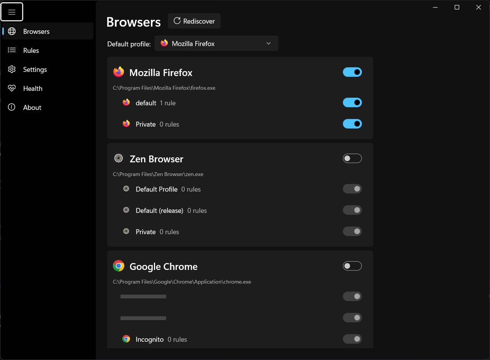
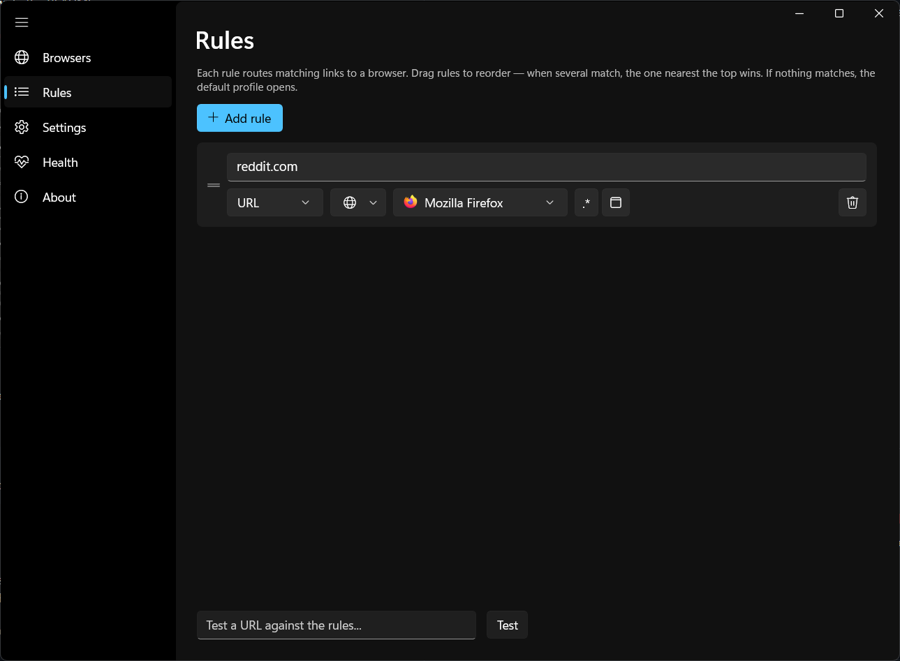
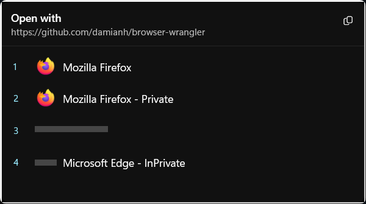

# Browser Wrangler

[](https://github.com/damianh/browser-wrangler/actions/workflows/ci.yml)
[](https://github.com/damianh/browser-wrangler/actions/workflows/release.yml)
[](https://github.com/damianh/browser-wrangler/releases/latest)
[](LICENSE)

Browser Wrangler registers itself as a browser on Windows, intercepts the links
you click, and routes them to the right browser and profile based on rules you
define — with an optional picker popup and toast notifications.

It is a .NET 10 / WinUI 3 fork of [Browser Tamer](https://github.com/aloneguid/bt)
by [aloneguid](https://github.com/aloneguid), licensed under the Apache License 2.0.

## Installation

```pwsh
winget install DamianH.BrowserWrangler
```

Or grab the installer / portable zip from the
[latest release](https://github.com/damianh/browser-wrangler/releases/latest)
(x64 and ARM64). Installs per-user — no admin required.

After installing, set Browser Wrangler as your default browser in
**Windows Settings → Apps → Default apps**.

## Features

- **Registers as a browser** — per-user registry (no admin), health checks with one-click fixes
- **Browser & profile discovery** — installed browsers, Chromium profiles, Firefox profiles, Firefox Multi-Account Containers, incognito/private entries, with real profile avatars
- **Rules engine** — substring/regex match on whole URL, domain or path; drag-to-reorder priority; fallback default profile; bt-compatible rule syntax (`scope:domain|priority:2|github.com`)
- **URL pipeline** — Outlook Safelinks unwrap, optional shortened-link expansion, and find/replace substitutions (`substr|find|replace`, `rgx|find|replace`)
- **Picker** — popup listing browsers/profiles with number-key shortcuts; triggered by hotkeys (Ctrl+Shift etc.), rule conflicts, or no-match
- **Toast** — brief notification showing which rule routed to which browser
- **Fast cold-start** — URL invocations route and launch without initializing XAML unless UI is needed; ReadyToRun-compiled releases
- **No background process** — runs on demand per click, exits when done

## Screenshots

### Browsers

Toggle which browsers and profiles appear in the picker.



### Rules

Drag to reorder — topmost matching rule wins. Test any URL against your rules.



### Picker

Pops up when a URL matches multiple rules, no rules, or when you hold a hotkey.
Pick with the mouse or number keys.



## Firefox containers

Browser Wrangler can route links to Firefox Multi-Account Containers as profile targets.

This requires the Firefox extension
[Open external links in a container](https://addons.mozilla.org/firefox/addon/open-url-in-container/)
to be installed in Firefox.

## Building

Requires .NET SDK 10 on Windows.

```pwsh
dotnet build src\BrowserWrangler -p:Platform=x64
dotnet test tests\BrowserWrangler.Core.Tests
```

Run `BrowserWrangler.exe` with no arguments for the config UI; go to the
**Health** page and click **Register as browser**, then set it as the default
browser in Windows Settings.

## Layout

- `src/BrowserWrangler.Core` — models, discovery, rules, pipeline, registry setup, launching (no UI deps)
- `src/BrowserWrangler` — WinUI 3 app: config UI, picker, toast
- `tests/BrowserWrangler.Core.Tests` — xUnit tests
- `installer/` — Inno Setup script and winget manifest templates

## License

Apache License 2.0 — see [LICENSE](LICENSE). Portions derived from
[Browser Tamer](https://github.com/aloneguid/bt), Copyright aloneguid,
Apache License 2.0 — see [NOTICE](NOTICE).
