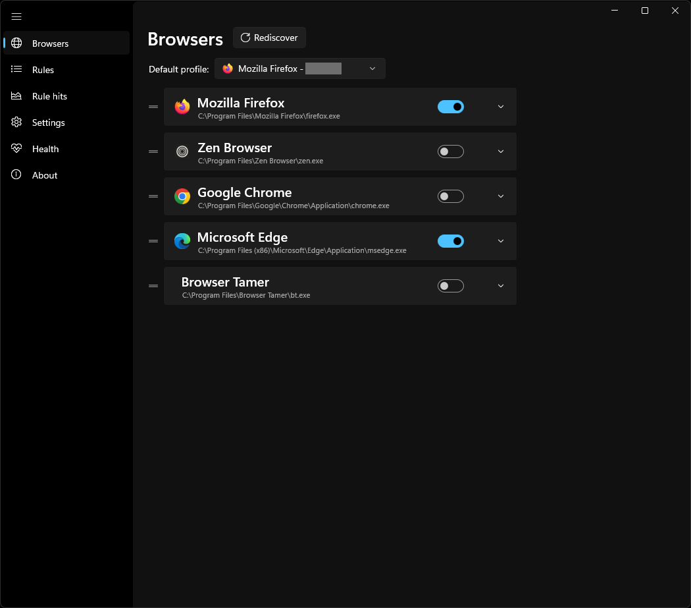
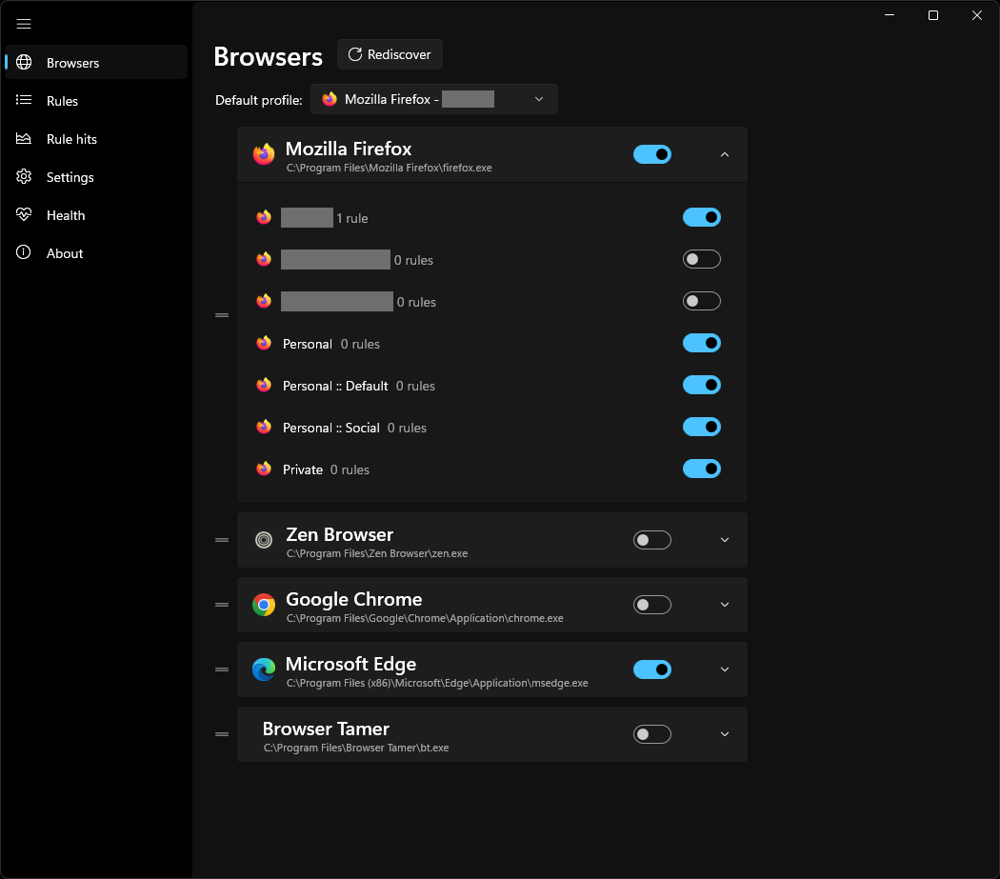
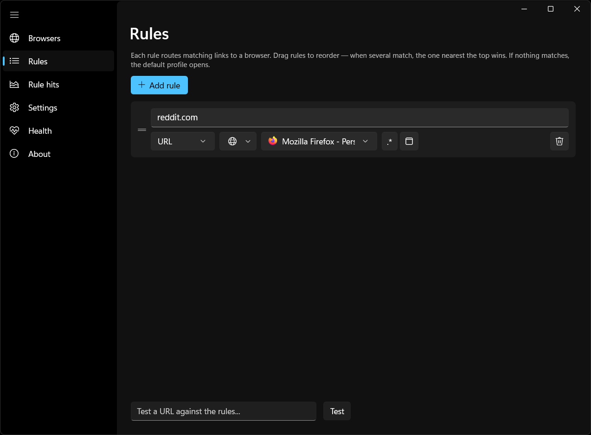
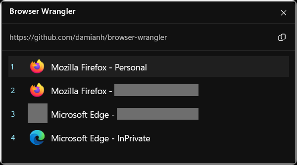

# Browser Wrangler

[](https://github.com/damianh/browser-wrangler/actions/workflows/ci.yml)
[](https://github.com/damianh/browser-wrangler/actions/workflows/release.yml)
[](https://github.com/damianh/browser-wrangler/releases/latest)
[](LICENSE)

Browser Wrangler registers itself as a browser on Windows, intercepts the links
you click, and routes them to the right browser and profile based on rules you
define — with an optional picker popup and toast notifications.

Project website (GitHub Pages): https://damianh.github.io/browser-wrangler/

It is a .NET 10 / WinUI 3 fork of [Browser Tamer](https://github.com/aloneguid/bt)
by [aloneguid](https://github.com/aloneguid), licensed under the Apache License 2.0.

## Installation

```pwsh
winget install DamianH.BrowserWrangler
```

Or grab the installer / portable zip from the
[latest release](https://github.com/damianh/browser-wrangler/releases/latest)
(x64 and ARM64). Installs per-user — no admin required.

The installer registers Browser Wrangler as a browser and opens a short setup
window afterwards. Windows only lets *you* pick the default browser, so that
window has a button straight to the right page in **Windows Settings** and ticks
itself off as soon as Windows reports the change. If you close it too early, the
app shows the same steps the next time you open it, and the **Health** page has
them permanently.

## Features

- **Registers as a browser** — per-user registry (no admin), guided first-run setup, health checks with one-click fixes
- **Browser & profile discovery** — installed browsers, Chromium profiles, Firefox profiles, Firefox Multi-Account Containers, incognito/private entries, with real profile avatars
- **Rules engine** — substring/regex match on whole URL, domain or path; drag-to-reorder priority; fallback default profile; bt-compatible rule syntax (`scope:domain|priority:2|github.com`)
- **URL pipeline** — Outlook Safelinks unwrap, optional shortened-link expansion, and find/replace substitutions (`substr|find|replace`, `rgx|find|replace`)
- **Picker** — popup listing browsers/profiles with number-key shortcuts; triggered by hotkeys (Ctrl+Shift etc.), rule conflicts, or no-match
- **Toast** — brief notification showing which rule routed to which browser
- **Fast cold-start** — URL invocations route and launch without initializing XAML unless UI is needed; ReadyToRun-compiled releases
- **No background process** — runs on demand per click, exits when done

## Screenshots

### Browsers

Toggle which browsers appear in the picker, and drag to reorder them.



Expand a browser to toggle its profiles, containers and private/incognito entries.



### Rules

Drag to reorder — topmost matching rule wins. Test any URL against your rules.



### Picker

Pops up when a URL matches multiple rules, no rules, or when you hold a hotkey.
Pick with the mouse, the number keys (`1`–`9`, `0` for the tenth entry), or the arrow keys plus `Enter`. `Esc` cancels.



## Firefox containers

Browser Wrangler can route links to Firefox Multi-Account Containers as profile targets.

This requires the Firefox extension
[Open external links in a container](https://addons.mozilla.org/firefox/addon/open-url-in-container/)
to be installed in Firefox.

## Building

Requires .NET SDK 10 on Windows.

```pwsh
dotnet build src\BrowserWrangler -p:Platform=x64
dotnet test tests\BrowserWrangler.Core.Tests
```

Run `BrowserWrangler.exe` with no arguments for the config UI; it re-registers
itself if the exe has moved, and shows the first-run setup window until Browser
Wrangler is the default browser. `--first-run` forces that window, `--register`
and `--unregister` are the silent installer hooks.

## Layout

- `src/BrowserWrangler.Core` — models, discovery, rules, pipeline, registry setup, launching (no UI deps)
- `src/BrowserWrangler` — WinUI 3 app: config UI, picker, toast
- `tests/BrowserWrangler.Core.Tests` — xUnit tests
- `installer/` — Inno Setup script and winget manifest templates

## Reporting a problem

Open the **About** page in the app and click **Report an issue**. That opens a bug
report with the app info (version, runtime, Windows build, config and log paths)
already filled in — please add a screenshot if you can. **Copy diagnostics** puts
the same block on the clipboard if you would rather paste it somewhere else.

The About page has a **Check for updates** button that compares your build
against the latest published stable release. Automatic stable-update checks are
enabled by default when the config app is open (you can turn them off in
**Settings**), and optional installer auto-download still requires manual
install confirmation.

## License

Apache License 2.0 — see [LICENSE](LICENSE). Portions derived from
[Browser Tamer](https://github.com/aloneguid/bt), Copyright aloneguid,
Apache License 2.0 — see [NOTICE](NOTICE).
